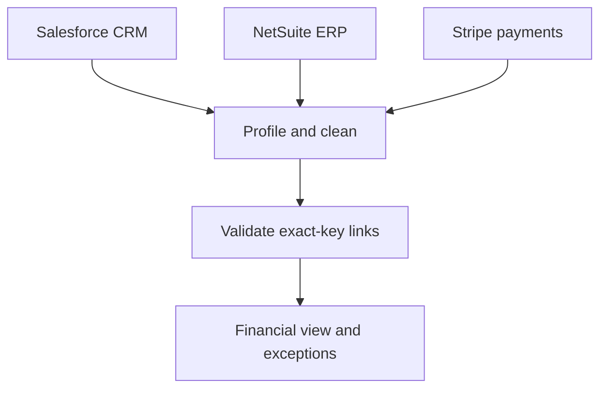

# Cross-System Customer Data Reconciliation

A Python data-integration case study connecting customer records across Salesforce, NetSuite, and Stripe-style datasets.

This repository began as a **company-provided technical assignment**. It uses supplied case data and represents an analytical solution, not a production system operated inside the company.

## Problem

Each system uses its own customer identifier:

| System | Role | Primary identifier | Shared linkage |
|---|---|---|---|
| Salesforce | CRM | `Account_ID` | `Stripe_ID` |
| NetSuite | ERP | `Customer_ID` | `Stripe_ID` |
| Stripe | Payments | `Customer_ID` | Salesforce metadata |

Duplicate keys, missing identifiers, mixed date formats, and inconsistent currency notation make direct reporting unreliable. The project profiles those problems, cleans each source, checks the relationships, and produces a combined financial view with unresolved records kept visible.

## Workflow



The workflow is intentionally deterministic. Records are joined through supplied identifiers; the project does not use fuzzy or probabilistic identity matching.

## Input scope

The committed case data contains **12,566 rows**:

| Source | Raw rows | Main issues |
|---|---:|---|
| NetSuite | 1,030 | Duplicate rows, invalid revenue values, missing `Stripe_ID` |
| Salesforce | 1,030 | Duplicate rows, inconsistent phone formatting |
| Stripe | 10,506 | Duplicate rows, invalid amounts, mixed dates and currency formats |

The cleaning logic handles written-month, ISO, and day-first numeric dates. Currency parsing supports examples such as `€494,53`, `€1.696,47`, and `$1,766.19`.

## Corrected cleaning results

After the current cleaning pipeline runs:

| Source | Rows retained | Key cleaning result |
|---|---:|---|
| NetSuite | 980 | 30 duplicates and 20 invalid revenue rows removed |
| Salesforce | 1,000 | 30 duplicates removed; 1,000 phone values standardised |
| Stripe | 10,000 | 306 duplicates and 200 invalid amount rows removed |

The cross-system analysis then reports:

- **1,000** payment-gateway IDs in the outer-joined financial output
- **49** retained NetSuite rows with missing `Stripe_ID`
- **675** Stripe transaction rows that cannot be matched to NetSuite
- **1** name conflict among records joined through a shared `Stripe_ID`

These are exception counts, not records that the pipeline claims to have resolved automatically.

## Implementation

### `primary_data_inspection.py`

Checks identifier uniqueness and inspects the expected relationships among the three raw sources.

### `inspect_duplicates.py`

Profiles duplicate `Account_ID`, `Customer_ID`, and `Stripe_ID` values. It also exports grouped duplicate records for review.

### `clean_datasets.py`

Applies repository-tested cleaning helpers for:

- Missing-safe identifier normalisation
- Mixed-format date parsing
- European and US currency parsing
- Duplicate removal and field validation

It writes canonical outputs to `Cleaned_Datasets/`.

### `analyse_cleaned_datasets.py`

Builds a financial view by payment-gateway ID, retrieves CRM context for selected payment patterns, and reports missing or unmatched links. The combined output is written to `Output_Data/combined_financials.csv`.

### `create_mock_data.py`

Creates optional synthetic support-ticket data for a possible downstream customer-service extension. It is not required by the core reconciliation workflow.

## Reliability

Five regression tests protect the cleaning rules that previously caused material errors:

- Decimal comma and decimal point amounts
- Thousands separators in both locale styles
- Mixed Stripe date formats
- Preservation of missing identifiers
- Numeric revenue precision

GitHub Actions runs the tests on pushes and pull requests.

## Run locally

```bash
python -m venv .venv
source .venv/bin/activate
pip install -r requirements.txt

python -m unittest discover -s tests -v
python primary_data_inspection.py
python inspect_duplicates.py
python clean_datasets.py
python analyse_cleaned_datasets.py
```

Run the commands from the repository root because the scripts use repository-relative data paths.

## Repository structure

```text
Original_Datasets/          supplied case inputs
Cleaned_Datasets/           canonical cleaned outputs
Duplicates_and_Profiles/    duplicate and linkage profiles
Output_Data/                combined financial output and mock extension data
ERD/                        relationship diagrams
tests/                      cleaning regression tests
Technical-Task-Report.pdf   original assignment report
```

The PDF is the original assignment report and reflects the earlier implementation. The current code, tests, README, and regenerated CSV outputs should be treated as the corrected portfolio version.

## Limitations

- Matching is exact-key linkage, so misspelled or absent IDs are surfaced rather than inferred.
- The case data does not demonstrate production scale, access controls, monitoring, or live orchestration.
- No labelled identity ground truth is available for measuring match precision and recall.
- The repository contains generated outputs as reviewable evidence, but a production pipeline would write versioned tables and exception logs instead of committed CSVs.

## Possible production design

A production version would introduce a governed master customer ID, quarantine unmatched records, and publish data-quality metrics for missing or conflicting identifiers. Ambiguous cases would require human review or a separately evaluated probabilistic matcher.
